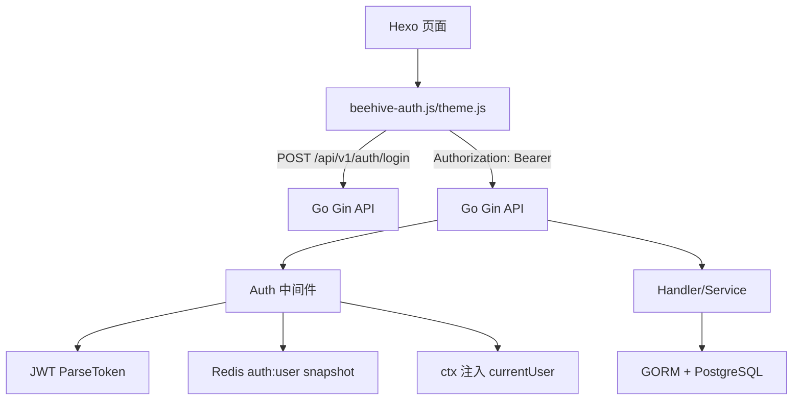

# Beehive-Blog 开发指南（前后端）

本文档用于指导本仓库的前后端开发与联调，重点覆盖：

- 后端（Go + Gin + PostgreSQL + Redis）的启动、鉴权链路、安全边界与扩展方式
- 前端（Hexo 主题 + Beehive 账号集成）的开发方式、调试手段与联调要点
- 前后端联调检查清单

---

## 1. 技术架构概览

系统由两部分组成：

1. 后端 API：提供登录/注册/用户信息/通知/资料修改等能力，并基于 JWT + Redis 快照做鉴权。
2. 前端静态站点：Hexo 生成页面，主题内通过 `fetch` 调用后端 API，完成账号登录态同步。



---

## 2. 代码与模块约定（后端）

后端遵循“分层开发”原则：路由只负责参数绑定与把请求转给业务层；业务层负责校验、调用模型/数据库、组织返回 DTO；统一响应从 `types/common/response.go` 输出。

### 2.1 目录结构（建议扩展位置）

- 路由入口与分组
  - `cmd/app/router/router.go`：Gin 路由注册、`/api/v1` 分组、Swagger/health
  - `cmd/app/routes/auth/*`：认证接口（登录/注册）
  - `cmd/app/routes/content/*`：公开内容接口（文章列表/详情等，无需登录）
  - `cmd/app/routes/user/*`：登录后接口（当前实现包含 me/profile/password/notifications/logout）
  - `cmd/app/routes/admin/*`：管理员接口（当前实现包含 `/api/v1/admin/ping`）
- 鉴权/限流/安全中间件
  - `cmd/app/middlewares/auth.go`
  - `cmd/app/middlewares/limit.go`
  - `cmd/app/middlewares/cors.go`
- 服务上下文与资源
  - `cmd/app/svc/serviceContext.go`：连接 PostgreSQL、Redis，并进行自动迁移
- DTO 与统一响应
  - `cmd/app/types/api/v1/*`：请求/响应结构
  - `cmd/app/types/common/response.go`：`success/fail` 返回结构

### 2.2 统一返回格式

所有 JSON 响应使用 `cmd/app/types/common/response.go` 的 `BaseResponse`：

- 成功：`{ code: 200, message: "success", data: ... }`
- 失败：
  - `4xx`：`message` 可能来自错误文本（但仍建议避免泄露敏感内部细节）
  - `5xx`：会统一替换为 `internal server error`，避免暴露实现细节

---

## 3. 后端开发指南

### 3.1 本地启动（推荐）

后端通过 Cobra + Viper 读取配置，入口是 `cmd/main.go`，实际启动在 `cmd/app/app.go`。

当前本地开发使用的配置文件是：

- `configs/Beehive-Blog.yaml`

启动示例（PowerShell）：

```powershell
go run .\cmd\main.go -f .\configs\Beehive-Blog.yaml
```

后端监听地址由配置决定（当前默认 `0.0.0.0:8081`）。

### 3.2 运行依赖与配置项

配置文件关键段：

- `server.bindAddress` / `server.bindPort`
- `db.*`（PostgreSQL）
- `redis.*`（Redis）

其中 JWT 配置在当前 YAML 中未出现，因此需要使用命令行参数或扩展配置：

JWT 相关选项来自 `pkg/options/jwt.go`，可通过命令行 flag 覆盖：

- `--jwtSecret/-s`
- `--expireDuration/-e`
- `--refreshTokenExpireDuration/-r`

> 安全注意：`jwtSecret` 如果未配置，将使用默认值 `default_jwt_secret`，不适合生产环境。

### 3.3 数据库初始化与表结构

数据库初始化脚本在：

- `db/init.sql`

该脚本依次导入模块化 SQL：

- `db/001_users.sql`
- `db/002_articles.sql`
- `db/003_comments.sql`
- `db/004_attachments.sql`
- `db/005_settings.sql`
- `db/006_notifications.sql`
- `db/007_seed.sql`
- `db/008_triggers.sql`

如果你启用了 `db.autoMigrate: true`，服务启动时会调用 GORM 自动迁移（`cmd/app/svc/serviceContext.go` 的 `autoMigrateModels`）。

### 3.4 鉴权链路（JWT + Redis 快照 + RBAC）

当前鉴权逻辑位于 `cmd/app/middlewares/auth.go`：

1. 从请求头读取 `Authorization: Bearer <token>`（解析在 `pkg/utils/auth/auth.go`）
2. 解析 JWT claims（`pkg/utils/jwt/jwt.go`）
3. 从 Redis 读取用户快照 `auth:user:<userID>`（`pkg/utils/auth/auth.go`）
4. 校验：
   - `status` 必须为 `active`
   - `role` 必须与 token claims 中的 role 一致
5. 校验通过后把 `currentUserId/currentUserRole/currentUserStatus` 注入到 `gin.Context`

RBAC：

- `cmd/app/middlewares/auth.go` 的 `RequireRoles(...)` 用于限制管理员等角色

Token 的签发与快照写入：

- 登录：`cmd/app/routes/public/login.go`（签发 token + 写入 Redis 快照 + 设置 TTL）
- 注册：`cmd/app/routes/public/register.go`（同样写入 Redis 快照）
- 登出：`cmd/app/routes/user/logout.go`（删除 Redis 快照，令 token 失效）

> 重要结论：在“纯 Redis 快照校验”模式下，只要 Redis 快照不存在或不匹配，token 即视为无效。

### 3.5 CORS 与跨域

CORS 配置在 `cmd/app/middlewares/cors.go`：

- 允许方法：`PUT/PATCH/GET/POST/OPTIONS/DELETE`
- 允许 headers：`Origin/Authorization/Content-Type/Accept`
- `AllowCredentials: true`，因此不允许使用 `*` 放行
- 允许来源策略：
  - `localhost/127.0.0.1/::1`
  - 或 `https://github.com` 前缀

> 联调时如果浏览器报跨域错误，优先检查前端来源与后端 CORS 策略是否一致。

### 3.6 限流策略

限流在 `cmd/app/middlewares/limit.go`：

- `/api/v1`：默认全局 IP 限流 `120 req/min`（本地内存计数器）
- 登录失败限流：IP + account 维度，默认 `8 次/15min`

> 注意：当前限流器是进程内存级别；多实例部署需要进一步改造为分布式限流（例如 Redis 或网关）。

### 3.7 Swagger 文档生成

接口文档通过 swaggo 生成，脚本在：

- PowerShell：`scripts/swagger/generate-swagger.ps1`
- Shell：`scripts/swagger/generate-swagger.sh`

生成命令核心逻辑是：

- `swag init -g cmd/main.go -o api/swagger/docs`

当你新增或修改 handler 的 swaggo 注释时，建议重新生成 Swagger 并检查输出文件是否更新：

- `api/swagger/docs/swagger.yaml`
- `api/swagger/docs/swagger.json`
- `api/swagger/docs/docs.go`

---

### 3.8 文章/评论/附件接口契约（规划）

说明：本节以 `docs/requirements.md` 的接口契约为准，用于指导后续接口实现与前后端对齐。当前代码未必已全部暴露这些 endpoint。

#### 3.8.1 文章管理模块（规划接口契约）

- `GET /articles`（访客/普通用户/管理员）
  - 查询参数：`page`、`pageSize`、`keyword`、`category`、`tag`、`status`（默认 `published`）、`author`、`sort`（默认 `newest`）
  - 业务规则：
    - `category` 与 `tag` 可同时筛选，结果取交集
    - 普通场景仅返回 `published`；管理员可查看全部（含草稿/私密等）
    - 支持多标签筛选（逗号分隔）
- `GET /articles/:id`（访客/普通用户/管理员）
  - 业务规则：
    - 阅读量 `+1`（需防刷机制）
    - 私密文章仅管理员可见
- 管理端（仅管理员）
  - `POST /articles`（创建）
    - 支持草稿/发布两种状态，内容支持 Markdown
  - `PUT /articles/:id`（编辑）
    - 可选保留历史版本（版本历史见下）
  - `DELETE /articles/:id`（删除）
    - 软删除，删除时关联删除文章-标签关系
  - `PUT /articles/:id/status`（设置文章状态）
  - `PUT /articles/:id/slug`（别名/路由）
    - 访问规则：`/archives/{slug}`
  - `PUT /articles/:id/password`（密码保护）
    - 为空则取消保护；访问受保护文章需校验密码
  - `PUT /articles/:id/pin`（置顶）
    - 按 `pinOrder` 降序展示，可同时置顶多篇
  - `POST /articles/:id/versions/:versionId/restore`（恢复版本）
  - `GET /articles/:id/versions`（查看历史）
    - 保留最近约 50 个版本
  - `GET /articles/:id/export?format={format}`（导出）
    - `format` 支持：`markdown` / `html` / `pdf`
  - `POST /articles/batch`（批量操作）

#### 3.8.2 评论管理模块（规划接口契约）

- `GET /articles/:id/comments`（访客/普通用户/管理员）
  - 业务规则：按文章查看评论列表、支持分页、支持评论回复（嵌套展示）
- `POST /comments`（普通用户/管理员；需要登录）
  - 业务规则：
    - 输入：文章 ID、评论内容、父评论 ID（回复时）
    - 评论内容长度 1-2000 字符
    - 新评论默认状态为 `pending`
    - 发表评论可获得经验值（按需求文档规则）
- 管理端（仅管理员）
  - `DELETE /comments/:id`
    - 软删除；删除父评论时子评论一并处理
  - `PUT /comments/:id/status`
    - 审核评论状态（`pending/approved/rejected/spam` 等）

#### 3.8.3 附件管理模块（规划接口契约）

- 管理端（仅管理员）
  - `GET /attachments`（附件列表）
    - 支持按类型、时间筛选；展示文件大小、上传时间
  - `POST /attachments/upload`（上传附件）
    - 支持类型：
      - 图片：`jpg/jpeg/png/gif/webp`
      - 文档：`pdf/doc/docx/xls/xlsx/ppt/pptx`
      - 其他：`zip/rar/tar.gz`
    - 业务规则：单文件最大 1GB、图片自动生成缩略图、重命名避免冲突
  - `DELETE /attachments/:id`（删除附件）
    - 物理删除文件 + 删除数据库记录
  - 附件分类与策略/分组/批量/搜索/详情（均为管理员权限）
    - 存储策略：
      - `GET /attachments/policies`
      - `POST /attachments/policies`
      - `PUT /attachments/policies/:id`
      - `DELETE /attachments/policies/:id`
      - `PUT /attachments/policies/:id/default`
    - 分组：
      - `GET /attachments/groups`
      - `POST /attachments/groups`
      - `PUT /attachments/groups/:id`
      - `DELETE /attachments/groups/:id`
    - 批量操作：
      - `POST /attachments/batch`
    - 搜索：
      - `GET /attachments?keyword={keyword}`
    - 详情：
      - `GET /attachments/:id`

---

### 3.9 当前代码实现缺口（路由未暴露）

当前 Gin 路由主要分组：

- 认证接口：`cmd/app/routes/auth`（`POST /api/v1/auth/login`、`POST /api/v1/auth/register`）
- 公开内容：`cmd/app/routes/content`（例如 `GET /api/v1/articles` 等）
- 已登录接口：`cmd/app/routes/user/handler.go`（目前包含 `GET /api/v1/user/me`、`PUT /api/v1/user/profile`、`PUT /api/v1/user/password`、`GET /api/v1/user/notifications`、`POST /api/v1/user/logout`）
- 管理员接口：`cmd/app/routes/admin/handler.go`（探活、Hexo 同步、文章管理等）

`docs/requirements.md` 中仍有大量规划接口（评论、附件、搜索等）未完全暴露。后续实现时，需要：

1. 在对应分组（public/user/admin）新增路由注册
2. 为 handler 添加 swaggo 注释，保证 Swagger 可生成
3. 在 service/model 层完成业务逻辑与数据持久化

---

### 3.10 扩展实现落点映射（把契约变成代码）

根据接口权限矩阵与当前项目分组方式，建议遵循：

- 访客/普通用户可读接口（例如 `GET /api/v1/articles`、`GET /api/v1/articles/:id`、`GET /api/v1/articles/:id/comments`）
  - 放在 `cmd/app/routes/content`（或同类命名）对应 handler（不挂 `middlewares.Auth`）
- 需要登录的接口（例如 `POST /comments`）
  - 放在 `cmd/app/routes/user`，并挂载 `middlewares.Auth(svcCtx)`
- 仅管理员接口（例如文章增删改、评论审核、附件管理、策略/分组/批量/搜索等）
  - 放在 `cmd/app/routes/admin`，并挂载 `middlewares.Auth(svcCtx)` + `middlewares.RequireRoles(models.UserRoleAdmin)`

> 备注：该映射只用于落点指导；具体字段校验、分页策略、限流策略等仍应以 `docs/requirements.md` 的业务规则为准，并在 handler/service 内实现完整的边界检查与错误处理。

## 4. 前端开发指南（Hexo 主题 + 账号集成）

本项目前端位于 `ui/hexo`，主题源码在 `ui/hexo/themes/happyladysacue`。

### 4.1 启动 Hexo

安装依赖（建议使用 pnpm）：

```powershell
cd ui/hexo
pnpm install
```

启动开发服务器：

```powershell
pnpm run server
```

构建静态站点：

```powershell
pnpm run build
```

清理构建产物：

```powershell
pnpm run clean
```

### 4.2 Theme 开发入口与组织方式

- 全局布局：`themes/happyladysacue/layout/layout.ejs`
  - 注入 `window.__HLS_THEME__` 和 `window.__BEEHIVE_API_BASE__`
  - 按配置加载 `beehive-auth.js`
  - 加载 `theme.js` 与 `pretext-enhance.js`
- 主题样式：`themes/happyladysacue/source/css/theme.css`
  - 含渐进动画的 CSS 类：`will-reveal` / `is-revealed`
- 前端交互脚本：
  - `themes/happyladysacue/source/js/theme.js`：主题交互、滚动感知、渐进卡片出现
  - `themes/happyladysacue/source/js/beehive-auth.js`：账号登录/用户态同步
  - `themes/happyladysacue/source/js/pretext-enhance.js`：Pretext 摘要/标题布局增强

### 4.3 Beehive API 地址配置

后端 API 基地址配置在：

- `themes/happyladysacue/_config.yml`：`beehive.api_base`

并在全局布局中注入到：

- `themes/happyladysacue/layout/layout.ejs`：`window.__BEEHIVE_API_BASE__`

开发联调时确保两者一致，例如本地后端：

- `configs/Beehive-Blog.yaml`：`server.bindPort: 8081`
- `beehive.api_base: http://127.0.0.1:8081`

### 4.4 账号集成（登录/用户态/登出）

账号前端集成逻辑在 `themes/happyladysacue/source/js/beehive-auth.js`：

- Token 存储（浏览器本地）：
  - `beehive_token`
  - `beehive_refresh_token`
- 登录表单挂载点：
  - `ui/hexo/source/login/index.md`：`<div id="beehive-login-root"></div>`
  - 注册表单挂载点：
    - `ui/hexo/source/register/index.md`：`<div id="beehive-register-root"></div>`
- 登录请求：
  - `POST /api/v1/auth/login`，请求体 `{ account, password }`
  - 登录成功后把 `token/refreshToken` 写入 localStorage，并跳转到首页 `/`
- 用户态刷新：
  - 在导航组件出现时调用 `GET /api/v1/user/me`
  - 请求头：`Authorization: Bearer <token>`
- 登出请求：
  - `POST /api/v1/user/logout`
  - 成功后清空 localStorage，并把导航状态切回访客态

> 说明：当前后端路由未实现“刷新 token 接口”，因此前端目前不会真正使用 `refreshToken` 做刷新；它的存在主要用于未来扩展或兼容返回字段。

### 4.5 Pretext 与渐进卡片动画

渐进卡片出现逻辑在 `themes/happyladysacue/source/js/theme.js`：

- 使用 `IntersectionObserver`
- 对以下元素选择器生效：
  - `.post-card`
  - `.sidebar-card`
  - `.taxonomy-pill-card`
  - `.taxonomy-cat-card`
  - `.taxonomy-card`
  - `.page-header-banner__inner`
- 动画通过 CSS 类切换：
  - 初始：`will-reveal`
  - 进入视口：追加 `is-revealed` 触发 transition
  - `transitionend` 后移除入场类，确保 hover transform 完整生效

Pretext 增强逻辑在 `themes/happyladysacue/source/js/pretext-enhance.js`：

- 仅对带 `data-pretext-title / data-pretext-excerpt / data-pretext-balance` 的元素测量并设置 `minHeight`
- 避免布局抖动（layout shift）

Pretext vendor 文件由脚本拷贝生成：

- `themes/happyladysacue/scripts/pretext-vendor.js`

---

## 5. 前后端联调检查清单

以下清单用于在出现问题时快速定位原因（建议按顺序执行）。

### 5.1 端口与地址一致性

- 后端是否在监听：`configs/Beehive-Blog.yaml` 的 `server.bindPort`（当前 8081）
- 前端注入的 `beehive.api_base` 是否与后端一致
- 浏览器 Network 中请求的 URL 是否落到正确的 `/api/v1/...`

### 5.2 登录闭环（最关键路径）

验证顺序：

1. 打开 `/login/`，填写账号密码
2. 请求是否成功命中 `POST /api/v1/auth/login`
3. 成功后是否写入 localStorage：
   - `beehive_token`
   - `beehive_refresh_token`
4. 进入首页或包含导航的页面后，是否调用 `GET /api/v1/user/me`
5. 若调用失败，重点检查：
   - 后端 `Auth` 中间件的 Redis 快照是否存在
   - CORS 是否拦截了请求
   - `jwtSecret` 是否一致（否则 token 校验会失败）
6. 点击“退出登录”后是否调用 `POST /api/v1/user/logout`
7. 退出后 localStorage 是否清空，导航是否回到访客态

### 5.3 常见故障归因

- 浏览器报跨域：通常是 CORS 策略不匹配（见 `cmd/app/middlewares/cors.go`）
- 登录成功但 `user/me` 返回 401：通常是 Redis auth snapshot 不存在或 role/status 不匹配（见 `middlewares/auth.go`）
- 5xx：通常是后端服务端错误；可结合服务日志定位（并注意不要在响应里泄露敏感信息）

---

## 6. 安全与生产化建议

### 6.1 绝不提交敏感信息

避免把以下内容提交到仓库：

- `jwtSecret`（或使用默认默认值的情况）
- 数据库密码、Redis 密码、TLS 私钥

建议通过环境变量/本地配置文件方式提供。

### 6.2 JWT secret 与 token 生命周期

必须为每个环境配置独立的 `jwtSecret`，并限制 token 生存期（`expireDuration`/`refreshTokenExpireDuration`）。

### 6.3 Redis 快照校验带来的安全收益与运维代价

收益：

- 登出立即失效（通过删除 `auth:user:<id>` 快照）

代价：

- Redis 必须可用，否则所有鉴权请求都可能失败（`Auth` 中间件会返回 500/401）

### 6.4 生产部署建议

当前配置默认：

- `db.sslMode: disable`（生产建议启用 TLS）
- `redis.enableTLS: false`（生产建议开启 TLS）

同时注意限流器为进程内存级别，多实例部署需升级为分布式限流策略。

---

## 7. 本指南的扩展方式（当你要新增接口时）

当你新增业务能力（例如文章/评论/附件等未来接口）时，建议遵循以下步骤：

1. 在 `cmd/app/types/api/v1/` 新增 request/response DTO，并加上必要的字段校验（binding tag）
2. 在 `cmd/app/routes/{public|user|admin}/` 新增 handler：
   - 只做参数绑定（`ShouldBindJSON/ShouldBindQuery`）与调用 service
   - 给 handler 加 swaggo 注释，便于 Swagger 自动生成
3. 编写 service 方法：
   - 使用 `context.WithTimeout` 或沿用请求 context
   - 对输入做边界检查与空值防御
4. 对需要鉴权的路由在 `Init(svcCtx)` 中挂载 `middlewares.Auth(...)`，需要 RBAC 则叠加 `middlewares.RequireRoles(...)`
5. 最后更新 Swagger（运行 `scripts/swagger/generate-swagger.*`）

