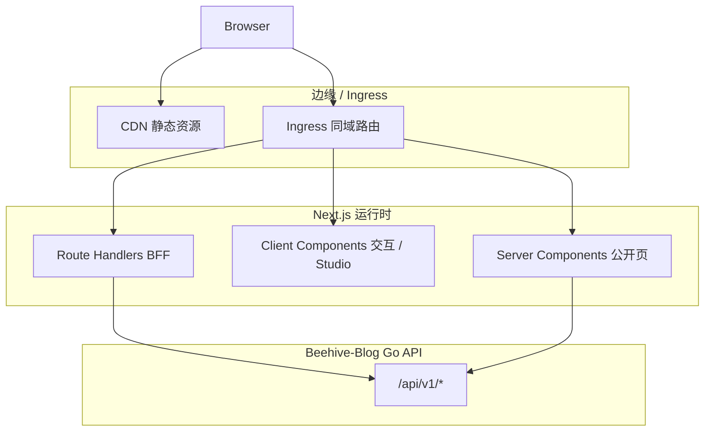

# React 前端技术架构：强 SSR / SEO 约定

本文档描述在本仓库 **Beehive-Blog（Gin `/api/v1`、统一 JSON 信封）** 前提下，**Public Web** 与 **Studio** 如何分工、如何与后端协同，以及**后续改动须遵守的边界**。不含阶段性任务清单。

| 属性 | 说明 |
|------|------|
| **读者** | 维护 `ui/`、BFF、部署与 SEO 的全栈 / 前端工程师。 |
| **Studio 布局** | 见 [Studio 布局约定](./studio-layout-implementation-plan.md)（与本文 **§3.3**、**§4.2** 对齐）。 |

**延伸阅读**：[产品设计原则（Public / Studio）](../product-principles.md)、[v1 登录与注册规则](../v1/login-and-registration-rules.md)。

---

## 目录

1. [目标与非目标](#1-目标与非目标)  
2. [与本仓库后端的硬约束](#2-与本仓库后端的硬约束)  
3. [推荐技术栈与质量](#3-推荐技术栈与质量)  
4. [总体架构](#4-总体架构)  
5. [数据获取与缓存](#5-数据获取与缓存)  
6. [SEO 约定](#6-seo-约定)  
7. [鉴权、OAuth 与 BFF](#7-鉴权oauth-与-bff)  
8. [部署、网络与安全](#8-部署网络与安全)  
9. [仓库布局与 CI](#9-仓库布局与-ci)  
10. [风险与缓解](#10-风险与缓解)  
11. [本仓库实现锚点](#11-本仓库实现锚点)  
12. [后续演进的边界](#12-后续演进的边界)

---

## 1. 目标与非目标

### 1.1 目标

| 维度 | 说明 |
|------|------|
| **SEO** | 可索引页首屏 HTML 含正文与语义结构；`title` / `description` / OG / Twitter 可控；sitemap 与结构化数据**单一事实来源**、可维护。 |
| **SSR / SSG** | 公开内容首屏由服务端或构建期产出 HTML，控制 CLS、LCP 与弱网体验。 |
| **契约一致** | 消费 `BaseResponse`；鉴权、OAuth、限流与 [v1 登录与注册规则](../v1/login-and-registration-rules.md) 对齐。 |
| **可演进** | 增加 ISR、按需 revalidate、边缘缓存时，**不破坏**路由分段（Public / Studio）与 BFF 边界。 |

### 1.2 非目标

- 不要求将 **Studio** 全树改为 RSC；工作台保持 **Client-heavy** 即可。
- 不要求在本仓库内再嵌套一层独立 monorepo；前端以现有 **`ui/`** 为界扩展。

---

## 2. 与本仓库后端的硬约束

以下来自当前 Gin 行为，前端**不得假设**不成立：

1. **无内置 CORS**：浏览器直连跨域 API 需网关或 Gin 补 CORS；生产推荐 **BFF 与前端同域** 或 **Ingress 同域路径** 反代 Go。
2. **JSON 鉴权响应**：登录等接口在 JSON 中返回 token；**持久会话**由 Next BFF 写入 **HttpOnly Cookie** 等策略承载（见 §7），浏览器业务代码**不得**长期持有 refresh。
3. **响应信封**：`{ code, message, data }`，HTTP 状态与 `code` 对齐；凡解析响应须走统一封装（如 `parseBaseResponse`）。
4. **GitHub OAuth**：`state` 服务端一次性校验；回调 URL 与后端 `redirect_uri` **严格一致**。
5. **限流**：注册 / 登录等路径有 IP 限流；UI 须防连点、**禁止**对 429 路径高频自动重试。

---

## 3. 推荐技术栈与质量

### 3.1 框架

本仓库 **`ui/`** 采用 **Next.js App Router + React 19**。能力对照：**RSC + `fetch` 缓存语义**、`generateMetadata`、`generateStaticParams`、**Route Handlers（BFF）**。

**备选栈**（若将来拆分仓库）：Remix、Astro + 岛等；**§2、§7、§8 仍适用**。

### 3.2 语言与质量

- **TypeScript 严格模式**；**ESLint + Prettier**。
- 与 Go 交互的 DTO 建议 **Zod** 或 OpenAPI 生成类型 + 运行时校验；关键路径可加 **Playwright** 做 SEO / 登录回归。

### 3.3 样式与可访问性

- **CSS Modules** 与 **Tailwind** 二选一、避免多体系混用；**当前为 CSS Modules**。
- 公开内容使用 **语义 HTML**（`article`、`nav`、`time` 等），利于 SEO 与 a11y。
- Studio 壳层样式约定见 [Studio 布局约定](./studio-layout-implementation-plan.md)。

---

## 4. 总体架构

### 4.1 逻辑分层

- 浏览器以 **同域 Next** 为首要入口（HTML、RSC payload、`/api/bff/*`）。
- **Next → Go**：Server Component 或 BFF 服务端 `fetch`；服务间认证（密钥、mTLS）由部署决定（§8）。

### 4.2 双轨渲染

| 面 | 路由示例 | 渲染策略 | SEO |
|----|----------|----------|-----|
| **Public Web** | `/`、`/posts`、`/posts/[slug]` 等 | RSC / SSG + SSR，首屏 HTML 含可读正文 | 强 |
| **Studio** | `/studio/*` | Client-heavy；layout 级 CSR 可接受 | 弱（`noindex` / `robots` disallow） |

与 [product-principles.md](../product-principles.md) 一致：**路由段显式分离**，禁止把 Studio 的私有元数据混入 Public 的 `generateMetadata` 默认路径。

---

## 5. 数据获取与缓存

### 5.1 公开内容

- 在 **Server Component** 中取数（经 BFF 或配置的 Go 基址）；**正文与列表核心字段**不得仅在客户端首屏后才出现。
- 引入 **ISR / `revalidate` / tag** 时：列表与详情使用**清晰、可文档化**的 tag 命名；发布链路须能触发 **按需 revalidate**（或由短 `revalidate` 兜底）。

### 5.2 登录态与首屏

- **已实现的推荐路径**：BFF 写入 **HttpOnly** 会话类 Cookie，Studio 与需鉴权请求经 **`/api/bff/...`** 或携带 BFF 注入的凭证策略访问 Go（具体见 `ui/lib/auth`、`ui/app/api/bff`）。
- **若将来存在「仅匿名 SSR」的公开页**：**不得**用登录态改写 `title` / 首屏正文，以免爬虫与普通用户看到不一致。

### 5.3 契约

- 以 **OpenAPI / Swagger** 为契约源时，CI 可生成 TS 类型并与实现交叉检查。
- 所有 JSON API 响应须经 **`parseBaseResponse<T>()`**（或等价物）校验 `code` 与 `data`，错误映射为统一用户可见文案。

---

## 6. SEO 约定

| 项 | 要求 |
|----|------|
| **元数据** | 可索引路由使用 `generateMetadata`：`title`、`description`、`openGraph`、`twitter`。 |
| **规范 URL** | `metadata.alternates.canonical`，避免重复索引。 |
| **结构化数据** | 文章等实体使用 **JSON-LD**（如 `BlogPosting`）；导航类可补充 `BreadcrumbList`。 |
| **sitemap** | **单一来源**（例如 Next `app/sitemap.ts` **或** Go 输出 XML），禁止两套并行维护同一批 URL。 |
| **robots** | `app/robots.ts`；`/studio`、`/login`、`/register`、`/auth` 等须 **disallow** 或等价不索引策略。 |
| **性能** | `next/image`、字体与关键 CSS、第三方脚本最小化，以满足团队 CWV 预算。 |

---

## 7. 鉴权、OAuth 与 BFF

### 7.1 Cookie 与 BFF

- **refresh / 长期凭证**仅由 **Route Handler** 写入 **HttpOnly + Secure + SameSite** Cookie；浏览器 JS **不可读** refresh。
- **变状态**的 BFF Route（登录、登出、改密、发信等）须考虑 **CSRF / 同源**（SameSite、`Origin` 校验或 token，按暴露面选择）。

### 7.2 GitHub OAuth

- 回调进入 **同域** Next 页面或 Route，**服务端**完成与 Go 的 `code` / `state` 交换并落 Cookie，再 `redirect`；**禁止**在 URL query 中长期携带 refresh。

### 7.3 错误与安全展示

- BFF 与 Go 错误经统一模型返回用户态文案；**禁止**向前端泄露内部堆栈或未文档化的字段。

---

## 8. 部署、网络与安全

| 主题 | 约定 |
|------|------|
| **同域** | 生产环境优先：站点域指向 Next，API 经同域 BFF 或受控反代访问 Go。 |
| **Go 暴露面** | 优先 **内网 + BFF**；若 Go 公网暴露，须单独加固与审计。 |
| **密钥** | OAuth `client_secret`、服务账号仅存在于 **服务端**环境变量，不进 `NEXT_PUBLIC_*`。 |
| **XSS 面** | CSP、输入消毒；会话优先 HttpOnly，减少 Bearer 长期滞留 `localStorage`。 |

---

## 9. 仓库布局与 CI

前端代码位于 **`ui/`**：

- `app/`：路由、`generateMetadata`、`robots.ts`、`sitemap.ts`、`api/bff/*`。
- `lib/api/`：信封解析、按域划分的 API 封装。
- `lib/auth/`：Cookie 名、session 读取等与 BFF 配套逻辑。
- `components/`：按 Public / Studio 分域组织，避免 Studio 专用组件被误用于可索引页核心结构。

**CI 建议**：`pnpm lint` → `pnpm test` → `pnpm build`；可选 `pnpm test:e2e`（需 Postgres/Redis 与 Go API，见 `ui/README.md`）；可选 OpenAPI 与 `api/swagger` diff。`NEXT_PUBLIC_*` 仅非秘密配置。

---

## 10. 风险与缓解

| 风险 | 缓解 |
|------|------|
| RSC / Client 边界混乱 | 仅 Client 文件使用 hooks；控制 `use client` 范围；文档化数据边界。 |
| SEO 与纯 CSR 混用 | 可索引详情**正文**必须在 RSC / SSG 路径取数。 |
| 双源 sitemap | 单一生成源，另一系统只消费或链接。 |
| Token 泄露 | BFF + HttpOnly；CSP；最小化内联脚本与第三方。 |

---

## 11. 本仓库实现锚点

修改行为时优先对照以下路径（**非任务列表**，仅导航现有实现）：

| 主题 | 路径（均在 `ui/` 下） |
|------|------------------------|
| BFF 登录 / 刷新 / 登出 / 注册 | `app/api/bff/auth/login`、`refresh`、`logout`、`register`；会话探测 `auth/session` |
| BFF 其他域（示例） | `app/api/bff/settings/*` |
| 公开文章 SSR / SSG / 元数据 / JSON-LD | `app/posts/[slug]/page.tsx` |
| 列表与首页 | `app/posts/page.tsx`、`app/page.tsx` |
| robots / sitemap | `app/robots.ts`、`app/sitemap.ts` |
| 信封与错误文案 | `lib/api/client.ts`（`parseBaseResponse`、`ApiError`、`humanizeApiError`） |
| 会话与 Cookie 名 | `lib/auth/session.ts`、`lib/auth/cookies.ts` |
| GitHub 回调 UI | `app/auth/github/callback/page.tsx`、`components/auth/GithubCallback.tsx` |
| Studio 壳与样式 | `components/studio/StudioLayout.tsx`、`Studio.module.css`、`app/studio/layout.tsx` |

---

## 12. 后续演进的边界

在引入 **ISR、边缘缓存、多区域部署、A/B** 时仍须遵守：

- **Public / Studio 路由与 SEO 策略**不得合并；Studio 不得进入 sitemap 的「可索引 URL」集合。
- **缓存键与失效**须与内容发布流程可运维地联动，避免「已发布仍长期旧 HTML」。
- **BFF 与 Go 的信任边界**变更（例如 Go 信任 BFF 服务身份）须在 §8 同步更新运维与密钥策略。

---

*框架大版本升级时请复核 RSC、`fetch` 缓存语义与 Next 安全配置。*
