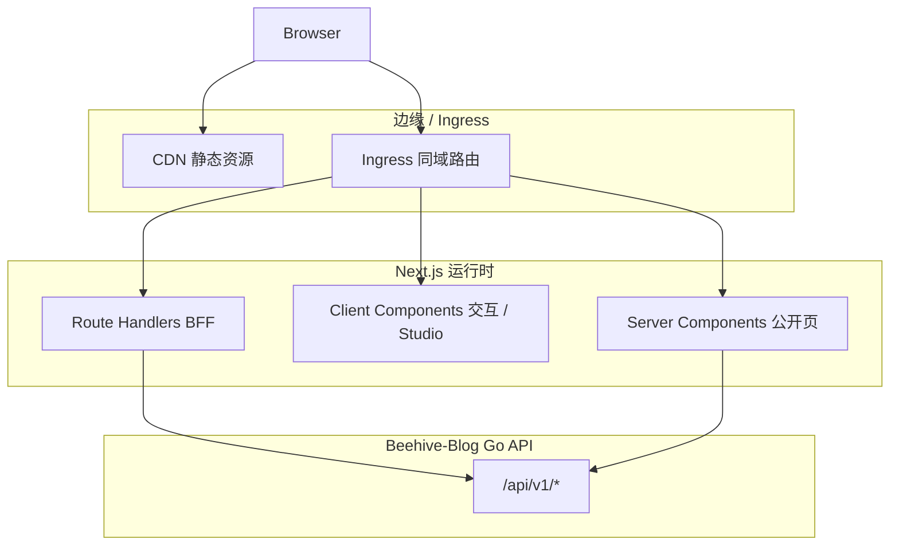

# React 前端技术架构：强 SSR / SEO 方案

本文档定义在 **需要强服务端渲染（SSR）与搜索引擎优化（SEO）** 前提下，与本仓库 **Beehive-Blog（Gin `/api/v1`、Bearer JWT、统一 JSON 信封）** 协同的 React 技术架构。适用于 **Public Web**（读者站、可被爬虫索引的页面）；**Studio**（工作台）可与下文「双轨渲染」策略并存。

**延伸阅读**：[产品设计原则（Public / Studio）](../product-principles.md)、[v1 登录与注册规则](../v1/login-and-registration-rules.md)。

---

## 1. 目标与非目标

### 1.1 目标

| 维度 | 说明 |
|------|------|
| **SEO** | 首屏 HTML 含可索引正文与语义结构；可控的 `title`/`description`/OG/Twitter Card；站点地图与结构化数据可自动化。 |
| **SSR / SSG** | 公开内容首屏由服务端或构建期产出 HTML，降低 CLS、改善 LCP 与弱网首屏。 |
| **与后端契约一致** | 消费 `BaseResponse` 信封；鉴权、OAuth、限流与 v1 规则对齐。 |
| **可演进** | 支持后续 ISR、按需静态化、边缘缓存，而不推翻路由与数据层抽象。 |

### 1.2 非目标（首版可不承诺）

- 将 **Studio** 全量改为 RSC 深度树（工作台可仍以 CSR 为主）。
- 在本仓库内 **内嵌** 前端 monorepo（文档仅描述推荐布局；落地时可独立仓库或 `web/` 子目录）。

---

## 2. 与本仓库后端的硬约束（架构必须消化）

以下事实来自当前 Gin 实现，前端架构**不能假设**不存在：

1. **无内置 CORS**：浏览器直连跨域 API 需网关或 Gin 补 CORS；**推荐生产形态**为 **BFF 与前端同域**，或 **Ingress 同域路径**（如 `/api` 反代至 Go）。
2. **鉴权为 `Authorization: Bearer`**：token 在 JSON 中签发，非 HttpOnly Cookie。**纯 SSR 页面若需「已登录态」个性化**，需在 BFF 将 session 转为 Cookie，或接受「首屏匿名 HTML + 客户端 hydration 再拉私有数据」。
3. **响应信封**：`{ code, message, data }`，HTTP 状态与 `code` 对齐；客户端与 Server Component 中的 fetch 需统一解析。
4. **GitHub OAuth**：`state` 存 Redis、一次性；回调页需与后端 `redirect_uri` 严格一致。
5. **限流**：注册与登录相关路径有 IP 限流；架构层应自带重试退避与防连点。

---

## 3. 推荐技术栈（选型结论）

### 3.1 框架：**Next.js（App Router）+ React 19**

在「强 SSR + 强 SEO」场景下，**Next.js App Router** 是当前生态中默认解：内置 **React Server Components（RSC）**、**Streaming SSR**、`generateMetadata`、Route Handlers（BFF）、与 Vercel/自托管 Node 的成熟部署路径。

| 能力 | 用途 |
|------|------|
| **RSC + `fetch` 缓存语义** | 公开文章/列表在服务端取数，HTML 直出。 |
| **`generateStaticParams` / ISR** | 高流量公开页构建期或增量静态化。 |
| **`generateMetadata`** | 每路由 SEO 与 OG。 |
| **Route Handlers (`app/api/*`)** | **BFF**：隐藏 refresh、统一 Cookie、同域调 Go。 |

**备选**：Remix（表单与 Web 标准取向强）、Astro + React 岛（内容站极轻）。若团队已深度 Remix，可将本文「Next」替换为 Remix 的 `loader`/`action` 心智，**BFF 与 SEO 章节仍适用**。

### 3.2 语言与质量

- **TypeScript 严格模式**。
- **Zod**：运行时校验 BFF 与 Go 之间的 DTO；可与 OpenAPI 生成类型交叉校验。
- **ESLint + Prettier**；关键路径 **Playwright**（公开页 SSR 快照、OG 回调页）。

### 3.3 样式与可访问性

- **CSS Modules** 或 **Tailwind CSS**（二选一，避免混用三种以上方案）。
- 公开内容组件遵循 **语义 HTML**（`article`、`nav`、`time`），利于 SEO 与 a11y。

---

## 4. 总体架构

### 4.1 逻辑分层



- **浏览器只与同域 Next 通信**（HTML、RSC payload、同域 `/api/bff/*`）。
- **Next → Go**：服务端 `fetch` 或 BFF 转发；携带服务间密钥或 mTLS 由部署决定（见第 8 节）。

### 4.2 双轨渲染（Public 强 SEO / Studio 强交互）

| 面 | 路由示例 | 渲染策略 | SEO |
|----|----------|----------|-----|
| **Public Web** | `/`、`/posts/[slug]`、`/projects/[id]` | RSC + SSR/ISR，首屏 HTML 含正文摘要 | 强 |
| **Studio** | `/studio/*` | Client-heavy；登录后路由可用 layout 级 CSR | 弱（`noindex`） |

与 [product-principles.md](../product-principles.md) 的 **Public / Studio** 划分一致：架构上 **显式分路由段**，避免 SEO 元数据泄漏到后台页。

---

## 5. 数据获取与缓存策略

### 5.1 公开内容（强 SEO）

- 在 **Server Component** 中调用后端（经 BFF 或直接内网 `fetch` Go）。
- 使用 Next **带标签的 revalidate**（`fetch(..., { next: { revalidate: N, tags: [...] } })`）或 **按需 revalidate API**，使发布/更新后公开页在可控延迟内更新。
- **列表 + 详情**：列表可较短 revalidate；详情页按 `slug` 标签失效。

### 5.2 个性化 / 登录态

- **选项 A（推荐用于「已登录首屏也要 SSR」）**：BFF 会话 Cookie + 服务端 `getSession()` 再请求 Go（Go 侧需信任 BFF 或走内部 JWT）。
- **选项 B（实现简单）**：公开页 SSR **匿名**；私有块用 Client Component + Bearer（内存或 `sessionStorage`），SEO 不依赖该块。

### 5.3 契约与类型

- 以仓库 **Swagger/OpenAPI** 为源：CI 生成 **TypeScript 类型**与可选 **openapi-fetch** 客户端。
- 统一 **`parseBaseResponse<T>()`**：校验 `code === 200` 与 `data` 形状，失败映射为可记录的错误类型。

---

## 6. SEO 实施清单

| 项 | 实现要点 |
|----|----------|
| **元数据** | `generateMetadata` 动态 `title`、`description`、`openGraph`、`twitter`。 |
| **规范 URL** | `metadata.alternates.canonical`，避免重复索引。 |
| **结构化数据** | 文章使用 `JSON-LD`（`BlogPosting` / `Article`）；面包屑 `BreadcrumbList`。 |
| **站点地图** | `app/sitemap.ts` 或由 Go 输出 XML 经 Ingress 暴露（二选一，避免双源不一致）。 |
| **robots** | `app/robots.ts`；`/studio` 默认 `noindex, nofollow`。 |
| **性能核心指标** | 图片 `next/image`；字体子集；关键 CSS；控制第三方脚本。 |

---

## 7. 鉴权、OAuth 与 BFF 边界

### 7.1 浏览器不长期持有 refresh（推荐）

- **Route Handler** 实现：`/api/bff/auth/login`、`refresh`、`logout`。
- **HttpOnly + Secure + SameSite** Cookie 存 refresh 或 session id；**access** 可短寿命放内存或第二 Cookie（按威胁模型选择）。
- Go API **可保持不变**；BFF 用服务端 `client_secret` 与 Go 通信，或使用仅内网可调用的刷新端点（需额外安全设计）。

### 7.2 GitHub OAuth

- 浏览器仍走 GitHub 回调到 **Next 的回调 Route**（同域），该 Route **服务端**调用 `POST /api/v1/auth/login`（`github_oauth2`），再写会话 Cookie，最后 `redirect` 到 `/studio` 或首页。
- **禁止**把长期 refresh 留在 URL query 中。

### 7.3 与现 v1 完全「无 BFF」模式

若首版不做 BFF：公开页仍可 SSR **匿名数据**；登录态仅客户端 Bearer——**SEO 页面不应用登录态改 title/正文**，避免爬虫与用户对首屏不一致。

---

## 8. 部署、网络与安全

| 主题 | 建议 |
|------|------|
| **同域** | `www.example.com` → Next；`www.example.com/api/v1` → Go 或 仅 BFF 暴露对外。 |
| **Go 不暴露公网** | BFF 与 Go 同 VPC；Go 仅内网监听。 |
| **密钥** | OAuth `client_secret`、服务账号仅存在于 Next 服务端环境变量。 |
| **CSRF** | Cookie 会话时，对变状态 Route Handler 使用 **SameSite=strict/lax** + CSRF token（若跨站提交表单）。 |

---

## 9. 仓库与 CI 建议布局

```
beehive-web/                    # 或 monorepo packages/web
  app/
    (public)/                   # 营销与阅读
    posts/[slug]/
    studio/                     # 工作台壳 + 子路由
    api/bff/                    # Route Handlers
  lib/
    api/                        # parseBaseResponse, openapi 客户端
  components/
  next.config.ts
```

- **CI**：`pnpm lint` → `pnpm test` → `pnpm build`；可选 **OpenAPI diff** 相对本仓库 `api/swagger`。
- **环境**：`NEXT_PUBLIC_*` 仅放非秘密配置；API base URL 指向同域 BFF 或内网 Go。

---

## 10. 风险与缓解

| 风险 | 缓解 |
|------|------|
| RSC 与客户端边界混乱 | 文档化「仅 Client 用 hooks」；ESLint 规则限制 `use client` 范围。 |
| SEO 与「纯客户端取数」混用 | 公开详情正文必须在 RSC/SSR 路径取数。 |
| 双源 sitemap | 单一生成源（Next 或 Go），另一处只做链接。 |
| Bearer 暴露在 XSS | CSP、输入消毒、优先 BFF + HttpOnly。 |

---

## 11. 演进路线（建议顺序）

1. **MVP**：Next App Router + Public RSC/SSR + 同域反代 Go + `generateMetadata` + `sitemap` + `robots`。
2. **Phase 2**：BFF 会话 + OAuth 回调收口 + ISR/标签失效与发布联动。
3. **Phase 3**：边缘缓存、A/B 与更细权限在 BFF 层聚合。

---

## 12. 前端落地计划列表

### 12.1 Phase 1：MVP，Public SSR/SEO + Studio 客户端登录

**目标**：先跑通公开内容 SEO 与基础登录，不引入完整 BFF Cookie 会话。首版登录态以客户端 Bearer 为主，公开页 SSR 默认按匿名用户渲染。

**任务清单**：

- [ ] 初始化 Next.js App Router 前端工程，启用 TypeScript strict、ESLint、Prettier。
- [ ] 确定部署形态：开发环境使用代理或环境变量访问 Go API；生产环境优先同域 `/api/v1` 反代到 Go。
- [ ] 实现统一 API 客户端：解析 `{ code, message, data }`，把 400/401/403/409/429/500 映射为前端可展示错误。
- [ ] 实现 Public 首页、文章列表页、文章详情页，详情正文必须在 Server Component / SSR 路径获取。
- [ ] 实现 `generateMetadata`，为首页、列表页、详情页输出 `title`、`description`、canonical、OG/Twitter Card。
- [ ] 实现 `app/robots.ts` 与 `app/sitemap.ts`，并明确 sitemap 由 Next 或 Go 单一来源生成。
- [ ] 实现本地注册、登录、刷新、登出 UI；登录账号支持用户名或邮箱，与 v1 登录规则保持一致。
- [ ] 实现 GitHub OAuth 前端入口与回调页：先调用 `/api/v1/auth/github/authorize`，回调后用 `code` + `state` 调 `/api/v1/auth/login`。
- [ ] Studio 路由使用客户端登录态保护；未登录跳转登录页；所有 `/studio/*` 设置 `noindex, nofollow`。
- [ ] 针对登录、注册、刷新接口处理 429：按钮防连点、展示稍后再试，不做高频自动重试。
- [ ] 添加基础验证：`pnpm lint`、`pnpm build`、公开文章页 HTML 快照或 Playwright smoke test。

**验收标准**：

- [ ] 未登录用户访问文章详情页时，首屏 HTML 含文章标题、摘要或正文关键内容。
- [ ] 查看页面源码可看到正确的 `title`、`description`、canonical 与 OG 基础字段。
- [ ] 登录、注册、refresh、logout 能按 v1 规则完成闭环；401/403/409/429 有明确 UI 提示。
- [ ] `/studio/*` 不进入 sitemap，并通过 robots/meta 禁止索引。
- [ ] `pnpm build` 通过，Public 页面不会依赖浏览器端二次请求才出现核心正文。

**暂不做**：

- [ ] 不做完整 BFF Cookie session。
- [ ] 不做已登录用户的强 SSR 个性化首屏。
- [ ] 不做复杂边缘缓存、A/B 实验或多租户权限聚合。

### 12.2 Phase 2：BFF Cookie 会话与 OAuth 收口

**目标**：把登录态从浏览器长期持有 Bearer/refresh，逐步迁移到 Next Route Handlers + HttpOnly Cookie，降低 XSS 泄露 refresh 的风险，并为已登录首屏 SSR 打基础。

**任务清单**：

- [ ] 新增 `/api/bff/auth/login`：服务端调用 Go `/api/v1/auth/login`，成功后写入 HttpOnly + Secure + SameSite Cookie。
- [ ] 新增 `/api/bff/auth/refresh`：服务端读取 Cookie 中的 refresh/session，调用 Go refresh 并轮换 Cookie。
- [ ] 新增 `/api/bff/auth/logout`：服务端调用 Go logout，并清理前端 Cookie。
- [ ] 新增 Next GitHub OAuth callback Route：服务端接收 `code`/`state`，调用 Go 登录接口，成功后写 Cookie 并 redirect。
- [ ] 明确 Cookie 策略：开发环境允许非 Secure，生产环境必须 Secure；SameSite 默认 `Lax`，跨站场景再评估。
- [ ] 对所有变状态 BFF Route 增加 CSRF 防护或同源校验，避免 Cookie 会话引入跨站提交风险。
- [ ] Studio 改为优先从 BFF session 获取登录态；客户端不再长期保存 refresh token。
- [ ] 为 BFF 增加单元测试或集成测试，覆盖登录成功、登录失败、refresh 轮换、logout 清理 Cookie。

**验收标准**：

- [ ] 浏览器 JavaScript 无法读取 refresh token。
- [ ] GitHub OAuth 不把长期凭证放入 URL query、localStorage 或 sessionStorage。
- [ ] Cookie 过期、refresh 失效、用户状态禁用时，Studio 能稳定回到登录页。
- [ ] BFF 错误响应仍保持前端统一错误模型，不向用户泄露 Go 内部错误。

### 12.3 Phase 3：缓存、发布联动与性能优化

**目标**：让公开内容更新、缓存失效、SEO 输出和 Core Web Vitals 进入稳定生产形态。

**任务清单**：

- [ ] 为文章详情、列表、标签页设计 Next `revalidate` 与 tag 命名规则。
- [ ] 文章发布、更新、删除后触发按需 revalidate，避免公开页长时间展示旧内容。
- [ ] 固化 sitemap 单一生成源；若由 Next 生成，Go 不再单独输出同一批 URL。
- [ ] 为文章详情页输出 `BlogPosting` / `Article` JSON-LD，为导航输出 `BreadcrumbList`。
- [ ] 优化图片加载：封面图使用 `next/image`，定义尺寸、占位与远程域名白名单。
- [ ] 优化字体与关键 CSS，控制 LCP、CLS、第三方脚本阻塞。
- [ ] 增加 Playwright SEO 回归：检查 HTML 正文、metadata、robots、sitemap、结构化数据。
- [ ] 增加生产观测：记录 BFF 错误率、Go API 响应耗时、SSR 渲染失败与缓存命中率。

**验收标准**：

- [ ] 发布或更新文章后，公开页在约定时间内刷新到新内容。
- [ ] sitemap 与实际可访问 Public 路由一致，无 `/studio/*`、无重复 canonical。
- [ ] 文章详情页通过结构化数据基本校验。
- [ ] 关键 Public 页面满足团队定义的 LCP/CLS 预算。

### 12.4 决策检查点

进入下一阶段前，建议先完成以下检查：

- [ ] Phase 1 完成后再决定是否进入 BFF Cookie 会话；若没有已登录首屏 SSR 或高安全要求，可继续保持 Bearer 客户端模式一段时间。
- [ ] Phase 2 开始前确认部署是否允许 Next 与 Go 同 VPC / 内网通信；否则 BFF 安全收益会下降。
- [ ] Phase 3 开始前确认内容发布流程已经稳定；否则过早做精细缓存失效会增加维护成本。

---

*文档版本：与 Beehive-Blog 后端 v1 行为对齐编写；框架小版本升级时请复核 RSC / `fetch` 缓存语义。*
