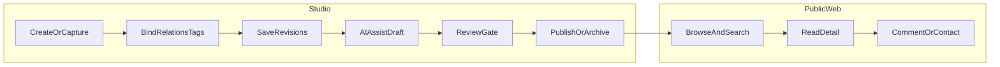

# Beehive Blog：产品设计原则（与 v2/v3 文档版本解耦）

本文档从 [v2 产品/需求/领域](v2/README.md) 与 [v3 工程基线](v3/README.md) 中提炼**与具体版本号无关**的一致产品设计理论，便于当前仓库实现与评审时对照。详细叙事与接口仍以 `docs/v2`、`docs/v3` 为准。

**延伸阅读**：[发布流程与版本纪律](release-process.md)（SemVer、清单、回滚、发布后观测）与下文「可审计」形成互补。

---

## 1. 产品定义与三类服务对象

- **定位**：个人博客 + **AI 协作创作** + **面向智能体的个人知识中台**（非纯 CMS、非纯知识库）。
- **三类对象**：
  - **Owner/创作者**：生产、整理、审阅、发布、控制权限。
  - **访客/读者**：消费公开表达（文章、项目、经历、专题、搜索等）。
  - **外部智能体**：在**可控上下文**下读取结构化知识，并辅助摘要、草稿、周报等。

**来源**：[v2-requirements-analysis.md](v2/v2-requirements-analysis.md) 第 1–3 节；[content-service-design.md](v3/content/content-service-design.md)（为公开站、Studio、search、indexer、agent 提供可信内容来源）。

---

## 2. 三条主价值链路（阶段一优先级）

1. **内容沉淀**：统一主实体 + 版本 + 关系（笔记/文章/项目/经历等可关联，而非孤岛文件）。
2. **公开展示**：读者侧清晰的信息架构与消费路径（列表、详情、专题、时间线等）。
3. **搜索与 AI 辅助**：检索入口 + AI 起草/摘要，且**必须经过人的审阅与发布闸门**。

**来源**：[v2-product-design.md](v2/v2-product-design.md) 第 1 节。

---

## 3. 双产品面：Public Web 与 Studio

| 面 | 职责 |
| --- | --- |
| **Public Web** | 对外认知与阅读：首页轻量、文章/项目/经历/搜索入口、评论与联系等。 |
| **Studio** | 对内工作台：实体管理、版本与关系、附件、发布与归档、（后续）搜索/索引状态、AI 草稿与审阅。 |

同一套内容在两侧通过**状态 + 可见性 + 发布动作**区分「给自己写」与「给读者看」。

**来源**：[v2-product-design.md](v2/v2-product-design.md) 第 2–4 节。

---

## 4. 内容类型与表达分工（理论层）

- **文章**：面向读者的正式输出；结构完整、适合公开展示。
- **笔记**：偏原始、碎片、默认更偏「自用 + AI 原材料」，不等同于正式文章。
- **项目**：结构化承载背景、目标、技术、结果，并**关联**文章、附件、经历。
- **经历 / 时间线**：以时间为轴的个人叙事能力；事件可绑定项目、文章、反思、作品。
- **反思/洞察、作品集、附件**：丰富表达维度与证据链。

**来源**：[v2-requirements-analysis.md](v2/v2-requirements-analysis.md) 第 4–5 节；[v2-domain-model.md](v2/v2-domain-model.md) 内容类型枚举与说明。

---

## 5. 领域级设计原则

1. **统一内容抽象、按类型扩展**：一个主数据模型承载多类型，避免「只有文章一张表」的瓶颈。
2. **主数据与检索副本分离**：关系型库为内容真相源；索引、向量、摘要等为派生数据，异步生成。
3. **关系优先、不写死层级**：项目—文章—经历—作品等用**关系**表达，避免目录式硬编码。
4. **AI 输出可审计**：草稿/摘要等需可追溯来源、任务、上下文与审阅结果（与发布流程、权限联动）。

**来源**：[v2-domain-model.md](v2/v2-domain-model.md) 第 2 节；[content-service-design.md](v3/content/content-service-design.md)（content 为内容真相源、outbox 等）。

---

## 6. 权限与发布：产品语言与工程语言

**产品语言（v2）**：[v2-product-design.md](v2/v2-product-design.md) 第 6 节 — 公开 / 仅登录 / 仅 owner；**AI 是否可读单独开关**；草稿与待审默认不对外、不对 AI。

**工程语言（v3）**：[permission-model.md](v3/permission-model.md) — `status`（draft / review / published / archived）+ `visibility`（public / member / private）+ `ai_access`（allowed / denied），再叠 RBAC；**判定顺序**：认证 → 角色 → 状态 → 人类可见性 → AI。

二者是同一产品约束的规范化：把「读者可见」与「agent 可读」拆开，并把发布闸门写进状态机。

---

## 7. 关键用户旅程

**来源**：[v2-product-design.md](v2/v2-product-design.md) 第 5 节。

---

## 8. 阶段边界与成功标准

- **必须**：公开展示、Studio 管理、身份、评论、搜索、项目与经历、AI 摘要/草稿 + 审阅路径、权限不串线。
- **可后置**：知识地图可视化、复杂推荐、多人协作、复杂 Agent 运营后台等。

**成功标准（概括）**：能稳定沉淀与关联内容、读者路径清晰、搜索可用、AI 增效率不增混乱、私密与 AI 边界清晰。

**来源**：[v2-product-design.md](v2/v2-product-design.md) 第 7–8 节。

---

## 9. 交付与发布纪律（与领域「可审计」对齐）

与 [release-process.md](release-process.md) 一致的方向：

- **SemVer**：对外契约与升级预期可沟通。
- **发布前清单**：CI、关键测试、安全评审、CHANGELOG、文档与配置同步。
- **回滚与事故响应**：含数据库回滚预案；变更可逆、责任可述。
- **发布后观测**：日志、错误率、延迟、资源。

这与第 5 节「可审计」互补：**领域审计（内容/AI）+ 工程审计（版本/发布/回滚）**。

---

## 文档索引

| 主题 | 路径 |
| --- | --- |
| v2 文档总索引 | [v2/README.md](v2/README.md) |
| v3 文档总索引 | [v3/README.md](v3/README.md) |
| 产品设计（完整页面与模块） | [v2-product-design.md](v2/v2-product-design.md) |
| 需求分析 | [v2-requirements-analysis.md](v2/v2-requirements-analysis.md) |
| 领域模型 | [v2-domain-model.md](v2/v2-domain-model.md) |
| Content 服务设计 | [content-service-design.md](v3/content/content-service-design.md) |
| 权限模型 | [permission-model.md](v3/permission-model.md) |
| 发布流程 | [release-process.md](release-process.md) |
