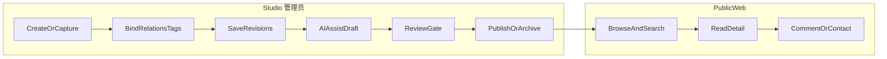

# Beehive Blog：产品设计原则

本文档给出当前仓库的**产品边界与领域约定**，供评审与演进时对照。详细 API 与表结构以 **代码、`docs/v1`、OpenAPI/Swagger** 为准；若本文与实现不一致，**以实现为准**。

| 属性 | 说明 |
|------|------|
| **定位** | 个人博客 + **AI 协作创作** + **面向智能体的个人知识中台**（非纯 CMS、非纯知识库）。 |
| **与实现** | 后端 **Go `/api/v1`**；读者站与工作台前端见 **`ui/`**；身份与登录 API 见 [v1 登录与注册规则](v1/login-and-registration-rules.md)；前端渲染与 BFF 见 [React SSR/SEO 约定](frontend/react-ssr-seo-architecture.md)、[Studio 布局约定](frontend/studio-layout-implementation-plan.md)。 |

**延伸阅读**：工程命令与迁移见仓库根目录 [CLAUDE.md](../CLAUDE.md)。

---

## 1. 三类服务对象

- **管理员**：站内**唯一**具备在 Studio 中**创作、整理、审阅、发布**及后台配置权限的角色；**不**再区分「站主 / Owner」与「创作者」——凡创作与内容治理均归管理员职责。
- **访客 / 读者**：消费公开表达（文章、项目、经历、专题、搜索等）；可注册、登录时仍**不**获得创作能力，除非被提升为管理员（以实际 RBAC 与账号策略为准）。
- **外部智能体**：在**可控上下文**下读取结构化知识，并辅助摘要、草稿、周报等。

---

## 2. 三条主价值链路（优先级约定）

下列顺序表示**产品投入与验收上的优先关系**，而非一次性「阶段门禁」清单。

1. **内容沉淀**：统一主实体 + 版本 + 关系（笔记 / 文章 / 项目 / 经历等可关联，而非孤岛文件）。
2. **公开展示**：读者侧清晰的信息架构与消费路径（列表、详情、专题、时间线等）。
3. **搜索与 AI 辅助**：检索入口 + AI 起草 / 摘要，且**必须经过人的审阅与发布闸门**。

---

## 3. 双产品面：Public Web 与 Studio

| 面 | 职责 |
| --- | --- |
| **Public Web** | 对外认知与阅读：首页、文章 / 项目 / 经历 / 搜索入口、评论与联系等。 |
| **Studio** | **仅管理员**使用的对内工作台：实体管理、版本与关系、附件、发布与归档、（后续）搜索 / 索引状态、AI 草稿与审阅。 |

同一套内容在两侧通过**状态 + 可见性 + 发布动作**区分「管理员维护中的草稿」与「读者可见的已发布内容」。工程上须保持 **路由与 SEO 策略分离**（可索引页 vs `noindex` 工作台），见 [react-ssr-seo-architecture.md](frontend/react-ssr-seo-architecture.md) §4.2。

---

## 4. 内容类型与表达分工（理论层）

- **文章**：面向读者的正式输出；结构完整、适合公开展示。
- **笔记**：偏原始、碎片、默认更偏「自用 + AI 原材料」，不等同于正式文章。
- **项目**：结构化承载背景、目标、技术、结果，并**关联**文章、附件、经历。
- **经历 / 时间线**：以时间为轴的个人叙事；事件可绑定项目、文章、反思、作品。
- **反思 / 洞察、作品集、附件**：丰富表达维度与证据链。

---

## 5. 领域级设计原则

1. **统一内容抽象、按类型扩展**：一个主数据模型承载多类型，避免「只有文章一张表」的瓶颈。
2. **主数据与检索副本分离**：关系型库为内容真相源；索引、向量、摘要等为派生数据，异步生成。
3. **关系优先、不写死层级**：项目—文章—经历—作品等用**关系**表达，避免目录式硬编码。
4. **AI 输出可审计**：草稿 / 摘要等须可追溯来源、任务、上下文与审阅结果（与发布流程、权限联动）。

---

## 6. 权限与发布（产品口径与工程口径）

**产品口径（可见性与 AI）**

- 人类可读范围：**公开** / **仅登录（member）** / **私有** 等档位可演进；**「可创作 / 可发布」仅管理员**。
- **AI 是否可读**与「访客能否读」**拆开**配置；草稿与待审默认**不**对公网、**不**对未授权智能体开放。

**工程口径（状态机与 RBAC，落地时以代码为准）**

- 内容建议具备 **`status`**（如 draft / review / published / archived）与 **`visibility`**（如 public / member / private）及可选 **`ai_access`**（allowed / denied），再叠 **RBAC**。
- **判定顺序（约定）**：认证 → 角色 → 状态 → 人类可见性 → AI。创作类接口须以**管理员角色**为闸门，与普通 `member` 等只读或受限能力区分。

二者将「读者可见」与「agent 可读」拆开，并把发布闸门写进状态机。

---

## 7. 关键用户旅程

---

## 8. 能力优先级与成功标准（约定）

- **高优先级**：公开展示、**管理员**在 Studio 中的内容管理与发布、身份与登录、评论、搜索、项目与经历、AI 摘要 / 草稿 + 审阅路径、权限不串线（非管理员不得获得创作入口）。
- **可后置**：知识地图可视化、复杂推荐、多人协作、复杂 Agent 运营后台等。

**成功标准（概括）**：能稳定沉淀与关联内容、读者路径清晰、搜索可用、AI 增效率不增混乱、私密与 AI 边界清晰。

---

## 9. 交付与发布纪律（与领域「可审计」对齐）

建议在团队工程规范中落实（可与 CI、CHANGELOG 挂钩）：

- **SemVer**：对外契约与升级预期可沟通。
- **发布前清单**：CI、关键测试、安全评审、CHANGELOG、文档与配置同步。
- **回滚与事故响应**：含数据库回滚预案；变更可逆、责任可述。
- **发布后观测**：日志、错误率、延迟、资源。

与第 5 节「可审计」互补：**领域审计（内容 / AI）+ 工程审计（版本 / 发布 / 回滚）**。

---

## 10. 文档索引

| 主题 | 路径 |
| --- | --- |
| v1 登录与注册 API 约定 | [v1/login-and-registration-rules.md](v1/login-and-registration-rules.md) |
| 前端 SSR / SEO / BFF | [frontend/react-ssr-seo-architecture.md](frontend/react-ssr-seo-architecture.md) |
| Studio 布局约定 | [frontend/studio-layout-implementation-plan.md](frontend/studio-layout-implementation-plan.md) |
| 仓库开发说明（构建、迁移、日志） | [CLAUDE.md](../CLAUDE.md) |

---

*历史 v2/v3 长篇设计文档已从本仓库移除；新增领域说明请写入 `docs/` 下独立文件并在本节索引。*
