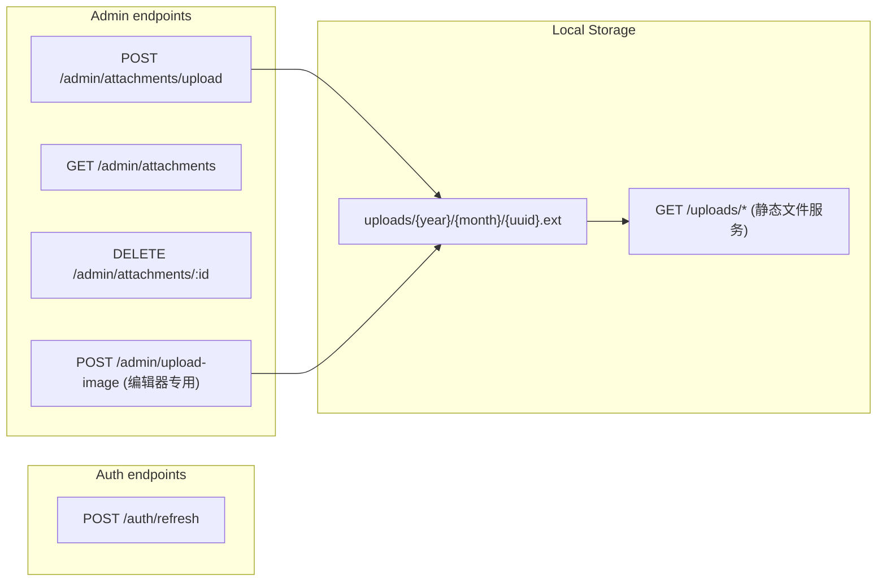

# Refresh Token、附件上传与编辑器图片拖入设计

本文档记录 Refresh Token 续期、本地附件存储与管理员编辑器图片拖入上传的设计与实现落点，便于查阅与前后端对齐。

---

## 架构总览



---

## 1. Refresh Token

### 现状分析

- `GenerateToken` 已生成 `RefreshToken`（仅含 `RegisteredClaims`，无 `UserID`/`Role`）。
- `ParseToken` 解析 `CustomClaims`，**无法**解析 Refresh Token（字段不匹配）。
- 登录/注册已返回 `refreshToken` 字段；前端可调用刷新接口续期（见下文接口）。

### 相关文件与契约

- `pkg/utils/jwt/jwt.go`  
  新增 `ParseRefreshToken` — 使用 `jwt.RegisteredClaims` 解析（与 Refresh Token 签发方式一致），返回 `*jwt.RegisteredClaims, error`。

- `cmd/app/types/api/v1/auth.go`  
  DTO：

```go
type RefreshTokenRequest struct {
    RefreshToken string `json:"refreshToken" binding:"required"`
}
type RefreshTokenResponse struct {
    Token        string `json:"token"`
    RefreshToken string `json:"refreshToken"`
    ExpiresIn    int64  `json:"expiresIn"`
}
```

- `cmd/app/routes/auth/refresh.go`  
  业务逻辑 `Refresh`：

  1. `jwt.ParseRefreshToken(secret, req.RefreshToken)` — 验证签名与 `ExpiresAt`
  2. 从 `claims.Subject` 解析 `userID`
  3. 查 DB 用户，验证 `status = active`
  4. `jwt.GenerateToken(...)` 生成新 `TokenPair`
  5. 写入 Redis 快照（`HSet` + `Expire`），覆盖旧条目（保持 `auth:user:{id}` 语义，旧 Access Token 在 JWT 自身 TTL 内仍有效，可接受）
  6. 返回新 `TokenPair`

- `cmd/app/routes/auth/handler.go`  
  `HandleRefresh` + 注册 `POST /api/v1/auth/refresh`（不走登录限流中间件）。

**对外路径**：`POST /api/v1/auth/refresh`

---

## 2. 附件上传（本地存储 MVP）

### 配置选项

- `pkg/options/storage.go`  

```go
type StorageOptions struct {
    UploadDir   string `json:"uploadDir"   mapstructure:"uploadDir"`   // 上传根目录，默认 "uploads"
    BaseURL     string `json:"baseUrl"     mapstructure:"baseUrl"`      // 访问前缀，默认 "http://localhost:8081/uploads"
    MaxFileSize int64  `json:"maxFileSize" mapstructure:"maxFileSize"`  // 单文件最大字节，默认 100MB
}
```

- `cmd/app/options/options.go`：在 `Options` 中嵌入 `*options.StorageOptions`，`mapstructure:"storage"`。
- `configs/Beehive-Blog.yaml`：新增 `storage` 段（示例见仓库内配置文件）。
- `cmd/app/svc/serviceContext.go`：启动时 `ensureDefaultStoragePolicy` — 幂等插入 `type=local`、`is_default=true` 的 `StoragePolicy`。
- `cmd/app/router/router.go`：`SetupStatic(uploadDir)` 注册 `GET /uploads/*` 静态文件服务；`cmd/app/app.go` 在启动流程中调用。

### 包 `cmd/app/routes/attachments/`

- **`service.go`**
  - `Upload`：校验大小与类型、生成 `{uploadDir}/{year}/{month}/...` 路径、写盘、图片则 `image.DecodeConfig` 取宽高、写 `attachments` 表、返回 `AttachmentItem`（`url` 由 `BaseURL` + 相对路径拼接）。
  - `List`：分页，支持 `type`、`keyword`（`name`/`original_name` ILIKE）、`groupId`。
  - `Delete`：删除记录并 `os.Remove` 物理文件；文件已不存在时仍完成 DB 删除以保证幂等。

- **`handler.go`**：`RegisterAdminRoutes` 在 `cmd/app/routes/admin/handler.go` 的 `Init` 中调用（不单独 `Init` 公开路由）。

**管理端路由**（均需 `Auth` + 管理员角色，前缀 `/api/v1/admin`）：

- `POST   /admin/attachments/upload`
- `GET    /admin/attachments`
- `DELETE /admin/attachments/:id`

### DTO

- `cmd/app/types/api/v1/attachment.go`  
  `AttachmentItem`、`AttachmentListQuery`、`AttachmentListResponse`、`DeleteAttachmentResponse` 等；`AttachmentItem` 含 `id`、`name`、`originalName`、`url`、`thumbUrl`、`type`、`mimeType`、`size`、`width`、`height`、`createdAt`。

---

## 3. 编辑器图片拖入自动引用

### 设计原则

管理员独立前端（非本仓库 Hexo 主题）通过本仓库提供的**上传接口契约**集成；静态资源通过 `GET /uploads/*` 访问。

### 后端：专用轻量端点

```
POST /api/v1/admin/upload-image
Content-Type: multipart/form-data
Authorization: Bearer <admin_token>

field: file (image/*)
```

成功响应（统一 JSON 包装见 `common.BaseResponse`）中 `data` 形如：

```json
{ "url": "http://...", "alt": "filename-without-ext" }
```

- 内部复用 `attachments.Service.Upload`，并强制 MIME 为 `image/*`。
- 与 `POST /admin/attachments/upload` 分离的原因：编辑器只需 `url` 与 `alt`，且可在此强校验类型，避免拖入非图片文件。

### 前端集成契约（管理员前端参考）

1. 在 Markdown 编辑区监听 `dragover`（`preventDefault`）与 `drop`。
2. `drop` 时从 `DataTransfer.files` 取图片文件。
3. `POST multipart/form-data` 至 `POST /api/v1/admin/upload-image`，请求头携带 `Authorization: Bearer <token>`。
4. 成功后在光标处插入 ``。
5. 失败时提示错误，不插入文本。

### 注册位置

`cmd/app/routes/admin/handler.go` 的 `Init` 中调用 `attachments.RegisterAdminRoutes`，其中同时注册 `POST /upload-image`（完整路径 `POST /api/v1/admin/upload-image`）。

---

## 4. 建议实现顺序（参考）

1. Storage 配置 + `ensureDefaultStoragePolicy` + 静态文件服务  
2. Refresh Token  
3. attachments 包（Upload / List / Delete）+ DTO  
4. `POST /admin/upload-image`  
5. 重新生成 Swagger（`swag init`，`--generalInfo cmd/main.go`）

---

## 5. Swagger

接口注释位于各 handler；生成物在 `api/swagger/docs/`（`swagger.yaml` / `swagger.json` / `docs.go`）。
