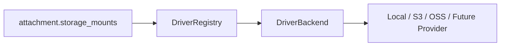

# Beehive-Blog v1：文件存储驱动架构

本文档只描述 **驱动模板、存储实例、挂载路径与驱动能力**。文件目录浏览、附件业务索引与上传路径策略分别见：

- [文件管理架构](file-management-architecture.md)
- [附件管理架构](attachment-management-architecture.md)
- [上传策略架构](upload-policy-architecture.md)

实现变更时须同步更新本文档；若本文与代码、迁移或 OpenAPI/Swagger 不一致，以实现和最新迁移为准。

**参考资料**：[OpenList Quick Start](https://doc.oplist.org.cn/guide)、[OpenList storage API](https://openlistteam.github.io/docs/zh/guide/api/admin/storage.html)。

---

## 1. 目标与边界

Beehive-Blog 借鉴 OpenList 的多存储挂载模型：驱动负责连接具体存储，存储实例用 `mount_path` 暴露为稳定入口。但本项目不是通用网盘程序，文件、附件、权限与文章引用必须以本项目数据库为真相源。

本层负责：

- 注册和展示存储驱动模板。
- 创建、编辑、启用、禁用、健康检查和删除存储实例。
- 保证活跃 `storage_mounts.mount_path` 唯一。
- 通过 `storage_mount_id -> driver_name -> DriverBackend` 解析读写能力。
- 记录驱动能力、配置 schema、实例状态和最后错误。

本层不负责：

- 展示具体目录和文件列表；这属于文件管理层。
- 管理附件分类、文章引用、孤儿附件；这属于附件管理层。
- 决定上传路径模板、大小限制、文件格式策略；这属于上传策略层。
- 实现 OpenList 级别离线下载、任务队列、WebDAV 暴露、远端实时浏览或批量打包下载。

---

## 2. OpenList 参考点

OpenList 是支持多种存储的文件列表程序。它的 storage API 围绕 `mount_path`、`driver`、`addition`、`status`、`disabled`、排序和代理策略组织存储实例。

本项目只采用这些抽象：

- `mount_path` 是用户可见的挂载入口，例如 `/local`、`/media`。
- 驱动类型与存储实例分离。
- 存储实例有启用/禁用、健康状态、排序和备注。
- 驱动特有配置集中在实例配置里。

本项目做出的裁剪：

- 使用 `JSONB config`，不使用 OpenList 的字符串化 `addition`。
- 不把 provider 远端目录当作实时真相源；Beehive-Blog 的 `storage_mounts`、`file_nodes`、`attachments` 是数据库真相源。
- 不在本层设计附件分类、引用关系或上传策略。

---

## 3. 领域模型

| 模型 | 职责 |
| --- | --- |
| `StorageDriver` | 驱动模板。描述驱动名、展示名、配置 schema、能力集合和启用状态。 |
| `StorageMount` | 管理员创建的存储实例。绑定驱动、挂载路径、实例配置、状态、默认标记。 |
| `DriverRegistry` | 后端运行时注册表。根据 `driver_name` 找到具体驱动实现。 |
| `DriverBackend` | 驱动接口。提供保存、预签名、读取、删除、健康检查等 provider 操作。 |

推荐解析链路：

---

## 4. 数据库表

### 4.1 `attachment.storage_drivers`

驱动模板表用于 Studio 渲染驱动选择和配置提示。驱动是否真的可用仍以 Go 运行时注册表为准。

关键字段：

| 字段 | 说明 |
| --- | --- |
| `name` | 内部驱动名，如 `local`、`s3`、`oss`。 |
| `display_name` | 管理端展示名。 |
| `description` | 驱动说明。 |
| `config_schema` | 驱动配置表单 schema。 |
| `capabilities` | 能力集合，如 upload、download、delete、presign、health_check。 |
| `status` | `active | disabled`。 |

约束：

- 活跃行内 `name` 唯一。
- `status IN ('active', 'disabled')`。
- 后端启动时可校验数据库 driver 与代码 registry 是否一致；缺失时记录英文日志，不阻断启动。

### 4.2 `attachment.storage_mounts`

存储实例表相当于 OpenList mounted storage，但面向 Beehive-Blog 裁剪。

关键字段：

| 字段 | 说明 |
| --- | --- |
| `driver_name` | 绑定的驱动名。 |
| `mount_path` | 唯一挂载路径，如 `/local`、`/images`。 |
| `name` | 管理端名称。 |
| `remark` | 管理备注。 |
| `config` | 驱动实例配置，使用 JSONB。 |
| `order_index` | 管理端排序。 |
| `is_default` | 未显式选择存储时的默认实例。 |
| `disabled` | 是否禁止新写入。 |
| `status` | `unknown | work | error`。 |
| `last_checked_at` / `last_error` | 健康检查结果。 |

约束：

- 活跃行内 `mount_path` 唯一。
- `mount_path` 必须以 `/` 开头，不允许 `/` 本身、`//`、`.`、`..` 路径片段和尾随 `/`。
- 同一时间最多一个 `is_default = true AND disabled = false AND deleted_at IS NULL`。
- `disabled = true` 阻止新写入；默认不切断已有文件读取。

---

## 5. 后端接口

当前和目标接口均保持 `/api/v1`：

| 方法 | 路径 | 说明 |
| --- | --- | --- |
| `GET` | `/api/v1/file-drivers` | 列出驱动模板。 |
| `GET` | `/api/v1/file-drivers/:name` | 查询单个驱动模板。 |
| `GET` | `/api/v1/storage-mounts` | 列出存储实例。 |
| `POST` | `/api/v1/storage-mounts` | 创建存储实例。 |
| `GET` | `/api/v1/storage-mounts/:id` | 查询存储实例。 |
| `PATCH` | `/api/v1/storage-mounts/:id` | 更新名称、备注、配置、排序、默认标记。 |
| `POST` | `/api/v1/storage-mounts/:id/enable` | 启用存储实例。 |
| `POST` | `/api/v1/storage-mounts/:id/disable` | 禁用存储实例。 |
| `POST` | `/api/v1/storage-mounts/:id/check` | 执行健康检查。 |
| `DELETE` | `/api/v1/storage-mounts/:id` | 软删除存储实例。 |

删除约束：

- 已有附件或文件节点引用的 mount 默认不允许删除，只允许禁用。
- 如未来支持强制删除，必须先定义读取失败策略、对象清理任务和审计日志。

---

## 6. Studio 展示

Studio 的“存储实例 / 文件驱动”分段负责本层能力：

- 存储实例列表：名称、挂载路径、驱动、默认状态、启用状态、健康状态、最近检查、错误摘要。
- 存储实例操作：添加、编辑、启用、禁用、设为默认、健康检查、删除。
- 文件驱动列表：驱动名、展示名、说明、状态、配置 schema、能力摘要。

不得在本层展示：

- 文件目录树。
- 附件分类。
- 文章引用关系。
- 上传策略编辑器。

---

## 7. 测试与验收标准

数据库与后端：

- 活跃 `storage_drivers.name` 唯一。
- 活跃 `storage_mounts.mount_path` 唯一。
- 同一时间最多一个启用默认 mount。
- 禁用 mount 不允许新写入。
- 已有引用的 mount 删除被拒绝。
- 健康检查正确更新 `status`、`last_checked_at`、`last_error`。

前端：

- Studio 能展示驱动模板与存储实例状态。
- 添加/编辑存储实例时按驱动配置 schema 或当前表单规则生成 config。
- 启用、禁用、健康检查、设默认、删除都有明确状态反馈。
